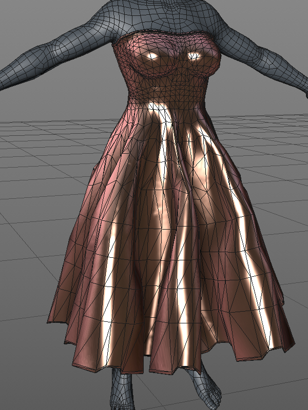

# Modelagem e Simulação de Corpos e Tecidos Deformáveis em Jogos (Modeling and Simulation of Deformable Bodies and Tissues in Games)

**Autor:** Matheus Najal Cruz

**Orientadora:** Dra. Maria Andréia Formico Rodrigues

**Instituição:** Universidade de Fortaleza
___

## Sumário

1. [Visão Geral do Projeto](#1-visão-geral-do-projeto)

2. [Problema e Motivação](#2-problema-e-motivação)

3. [Fundamentação Teórica - Classificação das Técnicas](#3-fundamentação-teórica---classificação-das-técnicas)

4. [Fundamentação Técnológica - Análise das Game Engines.](#4-fundamentação-técnológica---análise-das-game-engines)

5. [Trabalhos Relacionados - Uma Linha Evolutiva](#5-trabalhos-relacionados---uma-linha-evolutiva)

6. [Metodologia Científica](#6-metodologia-científica)

## 1. Visão Geral do Projeto

Este repositório contém a pesquisa e o desenvolvimento do meu Trabalho de Conclusão de Curso (TCC) em Ciência da Computação. O projeto foca na modelagem e simulação de corpos e tecidos deformáveis, com o objetivo de analisar e comparar técnicas para aplicação em motores de jogos modernos como Unity, Unreal e Godot.

O objetivo é alcançar um equilíbrio entre realismo visual, desempenho computacional e facilidade de integração, contribuindo para a criação de experiências gráficas mais imersivas e interativas.

 

## 2. Problema e Motivação

### Relevância

A simulação de objetos deformáveis é essencial para a vanguarda dos jogos, realidade virtual, animações e simulações médicas. A capacidade de representar de forma crível o comportamento de tecidos, roupas e outras superfícies elásticas eleva drasticamente a imersão e a interação do usuário com o ambiente virtual.

### Motivação

- **Necessidade de Realismo:** Representar objetos deformáveis de maneira  fisicamente plausível.

- **Desafios Técnicos:** Superar o alto custo computacional das simulações puramente físicas e a falta de realismo das abordagens puramente geométricas.

- **Integração com Motores Modernos:** Alinhar as simulações com as capacidades avançadas de *game engines* como Unity, Unreal e Godot.

## 3. Fundamentação Teórica - Classificação das Técnicas
As técnicas para simulação de corpos deformáveis podem ser classificadas em três categorias principais:

### As técnicas Geométricas:

- **Foco:** Aparência visual, descrevendo dobras com equaçõe matemáticas.
- **Vantagens:** Leveza e rapidez computacional.
- **Desvantagem:** Baixa fidelidade física, exigindo maior intervenção artística manual.
- **Exemplo:** Modelo de Weil (1986) com curvas catenárias.

### Técnicas Baseadas em Física:

- **Foco:** Modelagem do objeto como uma malha de partículas rigida por leis da física.
- **Vantagens:** Alto grau de realismo nas simulações.
- **Desvantagens:** Alto custo computacional e calibração complexa de parâmetros.
- **Exemplo:** Modelo de Massa-Mola.

### Técnicas Híbridas:

- **Foco:** Equilibrar realismo e desempenho.
- **Como funciona:** Combina a eficiência dos métodos geométricos com a precisão dos métodos físicos.
- **Exemplo:** Simulação física em baixa resolução para guiar as criação de detalhes com métodos geométricos.

## 4. Fundamentação Técnológica - Análise das Game Engines
uma parte central deste trabalho é a análise e implementação de simulações nas principais *game engines* do mercado.

| Recurso | Godot 4 (SoftBody3D) | Unity 6 (Cloth) | Unreal Engine 5 (Chaos)
| ----------- | ----------- | ----------- | ----------- |
| Suporte Nativo | Sim, atráves do nó Softbody3D | Parcial, com componente Cloth para tecidos | Sim, com os sistemas Chaos Flesh e Chaos Cloth |
| Estabilidade   | Instável, com bugs documentados | Estável, com soluções nativas e da Asset Store | Alta escalabilidade, robusto para grandes produções |
| Ferramentas    | Controle de parâmetros básicos | Ferramentas para tecidos, mas com colisão limitada | Solução completa com controle granular e ferramentas visuais avançadas

## 5. Trabalhos Relacionados - Uma Linha Evolutiva

### 1986:
Weil: Foi o pioneiro ao usar uma abordagem puramente geométrica. Ele modelou tecidos e curvas catenárias para simular o caimento de forma visualmente convincente e rápida, sem custo de uma simulação física.

### 1995:
Provot: Aprimorou o popular modelo massa-mola com uma solução prática para um problema comum: a instabilidade. Ele propôs um limite dinâmico para o alongamento das molas, o que evitou deformações irreais sem aumentar excessivamente a rigidez do sistema.

### 2007:
Harada et al. Revolucionaram a área ao implementar a Hidrodinâmica de Partículas Suavizadas (SPH) diretamente na GPU. Essa abordagem permitiu a simulação de fluidos e corpos deformáveis em tempo real, abrindo as portas para o nível de realismo que vemos nos jogos modernos.

## 6. Metodologia Científica

- O trabalho é uma pesquisa de natureza qualitativa, com objetivos exploratórios e descritivos.

- Foram empregados procedimentos de pesquisa bibliográfica e documental.

- A fundamentação teórica sobre técnicas de modelagem de tecidos baseou-se em uma análise sistemática de um artigo (Ng; Grimsdale, 1996)

- Foram investigadas técnicas de modelagem de corpos deformáveis através de artigos como:

    - Sistemas Massa-Mola (Provot et al., 1995)
    - Método dos Elementos Finitos (Debunne et al., 2000)
    - Métodos Baseados em Partículas (Harada; Koshizuka; Kawaguchi, 2007)