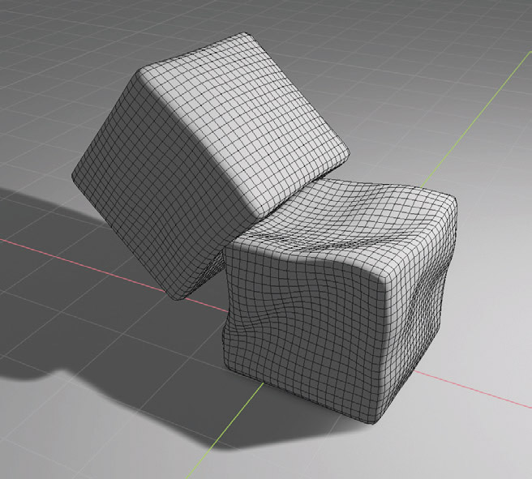

# Modelagem e Simulação de Corpos e Tecidos Deformáveis em Jogos (Modeling and Simulation of Deformable Bodies and Tissues in Games)

**Autor:** Matheus Najal Cruz

**Orientadora:** Dra. Maria Andréia Formico Rodrigues

**Instituição:** Universidade de Fortaleza

___

## Sumário

1. [Visão Geral do Projeto](#visão-geral-do-projeto)

2. [Problema e Motivação](#problema-e-motivação)

3. [Fundamentação Teórica](#fundamentação-teórica)

4. [Fundamentação Teórica](#fundamentação-teórica)

5. [Fundamentação Tecnológica](#fundamentação-tecnológica)

6. [Trabalhos Relacionados](#trabalhos-relacionados)

7. [Metodologia Científica](#metodologia-científica)

8. [Resultados e Imagens](#resultados-e-imagens)

9. [Contato](#Contato)

10. [Agradecimentos](#Agradecimentos)

11. [Licença](#Licença)

## Visão Geral do Projeto

Este repositório contém a pesquisa e o desenvolvimento do meu Trabalho de Conclusão de Curso (TCC) em Ciência da Computação. O projeto foca na modelagem e simulação de corpos e tecidos deformáveis, com o objetivo de analisar e comparar técnicas para aplicação em motores de jogos modernos como Unity, Unreal e Godot.

O objetivo é alcançar um equilíbrio entre realismo visual, desempenho computacional e facilidade de integração, contribuindo para a criação de experiências gráficas mais imersivas e interativas.

  

## Problema e Motivação

### Relevância

A simulação de objetos deformáveis é essencial para a vanguarda dos jogos, realidade virtual, animações e simulações médicas. A capacidade de representar de forma crível o comportamento de tecidos, roupas e outras superfícies elásticas eleva drasticamente a imersão e a interação do usuário com o ambiente virtual.

### Motivação

- **Necessidade de Realismo:** Representar objetos deformáveis de maneira  fisicamente plausível.

- **Desafios Técnicos:** Superar o alto custo computacional das simulações puramente físicas e a falta de realismo das abordagens puramente geométricas.

- **Integração com Motores Modernos:** Alinhar as simulações com as capacidades avançadas de *game engines* como Unity, Unreal e Godot.

## Fundamentação Teórica
As técnicas para simulação de corpos deformáveis podem ser classificadas em três categorias principais:

### As técnicas Geométricas:

- **Foco:** Aparência visual, descrevendo dobras com equaçõe matemáticas.
- **Vantagens:** Leveza e rapidez computacional.
- **Desvantagem:** Baixa fidelidade física, exigindo maior intervenção artística manual.
- **Exemplo:** Modelo de Weil (1986) com curvas catenárias.

### Técnicas Baseadas em Física:

- **Foco:** Modelagem do objeto como uma malha de partículas rigida por leis da física.
- **Vantagens:** Alto grau de realismo nas simulações.
- **Desvantagens:** Alto custo computacional e calibração complexa de parâmetros.
- **Exemplo:** Modelo de Massa-Mola.

### Técnicas Híbridas:

- **Foco:** Equilibrar realismo e desempenho.
- **Como funciona:** Combina a eficiência dos métodos geométricos com a precisão dos métodos físicos.
- **Exemplo:** Simulação física em baixa resolução para guiar as criação de detalhes com métodos geométricos.

